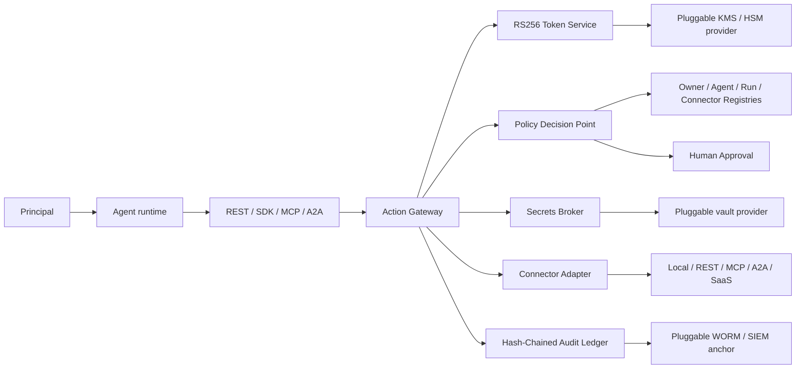

# Warden Agent Control Plane Architecture

Warden is generic; CASE-1042 is only a reference scenario.



## Invariants

1. Connectors are invoked only by the Action Gateway.
2. A request needs a valid RS256 capability and bound runtime proof.
3. Action, resource, tool, data class, environment and risk are checked separately.
4. Child scopes/resources only narrow and delegation depth is bounded.
5. Tokens and downstream credentials are never forwarded to connectors.
6. Production/high-risk writes require exact approved action/resource authority.
7. All security decisions are redacted and hash chained.
8. Revocation and the kill switch fail closed.

## Plug-and-play model

An owner registers manifests and connectors using API/UI data, not source-code
changes. Generic local emulators support arbitrary evaluation actions; external
systems use allowlisted REST, MCP or A2A adapters. Model/provider is metadata.

## Runtime identity

```text
principal_id → agent_id → run_id → task_id → tool_call_id
```

Capabilities add issuer, audience, key ID, token ID, scopes, resources,
delegation depth and parent token. Runtime proof means a token is insufficient
alone; production replaces it with mTLS/workload identity.

Cloud SDKs are optional adapters outside the core control plane. First-party
packs cover AWS, Azure, Google Cloud, HashiCorp Vault and PKCS#11 HSMs without
changing the gateway or its ports. See `docs/PROVIDERS.md` for configuration,
the portable HTTPS contract and native plugin contract, and
`docs/PRODUCTION.md` for operator-owned infrastructure requirements.
