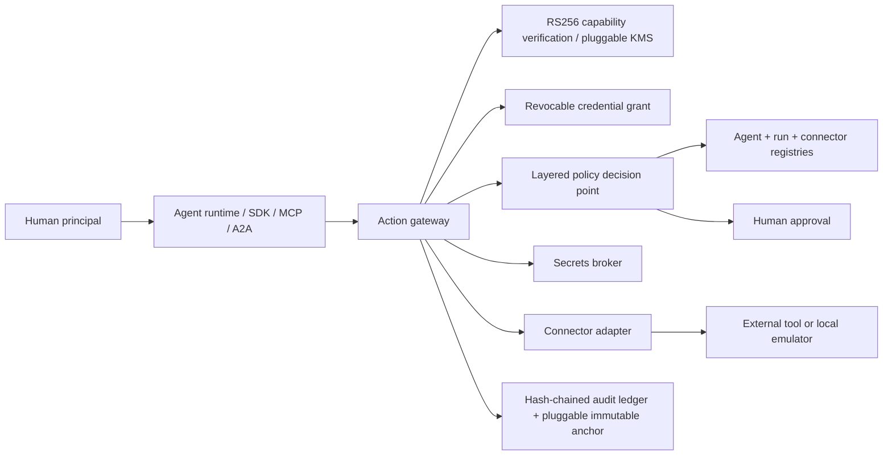

# Warden Agent Control Plane

Warden is a plug-and-play privileged-access control plane for arbitrary AI
agents. Agent owners describe identities, tools, actions, resources, data
classes, delegation relationships and risk limits in manifests. Agents never
receive downstream credentials and cannot execute a registered action without
passing the central gateway.

The former travel-specific Hermes, Wispr Flow, Linkup, ElevenLabs, Dodo and
Supabase integrations have been removed. `CASE-1042` is sample data proving the
generic architecture; it is not hard-coded product behavior.

## Enforcement path



## Implemented locally

- Owner-defined agent manifests with approval and lifecycle state
- Runtime identity: principal → agent → run → task → tool call
- RS256 capability tokens with key ID, issuer, audience, principal, run,
  scopes, resources, expiry, unique ID, parent ID and delegation depth
- Signing-key rotation/revocation and token/run/agent/connector/policy revocation
- Narrow child-token delegation with approved relationships and parent
  proof-of-possession
- Versioned JSON policy bundles, risk signals and fail-closed evaluation
- Monotonic platform, tenant, agent, connector and credential-grant policy layers
- Human approvals for production writes and high-risk connectors
- Mandatory action gateway with strict schemas, durable idempotency, distributed
  production rate limits, kill switch, redaction and egress allowlists
- Atomic single-use approval claims before external side effects
- Production OIDC authentication with tenant and role claims
- PostgreSQL connection pooling and database-enforced tenant RLS
- Vendor-neutral signing, secrets and audit ports with portable HTTPS and
  operator plugin contracts
- First-party optional provider packs for AWS, Azure, Google Cloud, HashiCorp
  Vault and PKCS#11 HSMs; no vendor SDK is installed in the core image
- HTTPS-only external connectors with redirect, private-address, content-type
  and response-size defenses
- Encrypted secret aliases resolved only during connector execution
- GitHub OAuth connections plus generic managed credentials, independently
  revocable grants, explicit agent delegation, method/path restrictions and
  refresh-token rotation under a distributed production lock
- Bearer, custom-header, multi-header, basic, query-key and AWS SigV4 credential
  injection performed inside the gateway without returning credentials to agents
- Owner-configurable local emulator, REST, MCP-upstream and A2A-upstream
  connectors, plus example support adapters
- REST, MCP `tools/call`, A2A `message:send` and Python SDK ingress
- Hash-chained redacted audit ledger, integrity verification and NDJSON export
- Web management console and generated OpenAPI documentation

## Start

```bash
python3.11 -m venv .venv
source .venv/bin/activate
pip install -r requirements.txt
cp .env.example .env
uvicorn control_plane.api:app --reload
```

Open `http://127.0.0.1:8000`. In development only, the fallback administrator
key is `local-development-admin-key`. Set `CONTROL_PLANE_ADMIN_KEY` for any
shared environment. Production mode refuses to start unless PostgreSQL, Redis,
OIDC, an external signing provider, a secrets provider and immutable audit
storage are all configured.

Integration documentation is served at `http://127.0.0.1:8000/documentation`
and the generated API reference at `http://127.0.0.1:8000/docs`.

## JavaScript and TypeScript SDK

The publishable package lives in `sdk-js/` and is named `@vouchins/warden`.
It is not reserved until its first successful npm publication:

```bash
cd sdk-js
npm ci
npm test
npm pack --dry-run
```

It is dependency-free at runtime, ships ESM, CommonJS and TypeScript
declarations, and supports Node.js 18+ and modern browsers. A tagged release
such as `sdk-v0.1.0` is published through npm trusted publishing with
provenance after its version and test gates pass.

## Run the architecture use case

```bash
python -m scripts.run_support_ticket
```

The example creates approved Support Triage and Code Reviewer agents, runtime
and task identities, scoped parent/child capabilities, approval-gated CRM and
Jira writes, an email draft, a read-only code review and a verified audit chain.

## Plug in any agent

1. Create an owner through `POST /admin/owners`.
2. Submit its manifest to `POST /owners/agents`.
3. Submit local-emulator, REST, MCP or A2A connectors through
   `POST /owners/connectors`.
4. An administrator reviews and activates both registrations.
5. Create a run and task and issue authority bound to the human principal.
6. Call `/actions/execute`, `/mcp/tools/call`, `/a2a/message:send`, or use
   `control_plane.sdk.WardenClient`.

For an external connector that uses a credential, set `grant_required: true`.
The action request must then include `grant_id`; Warden independently verifies
the capability and grant before policy evaluation, resolves the credential only
after an allow decision, injects it at the connector boundary, and redacts the
response and audit record. See [credential connections and grants](docs/CREDENTIALS.md).

The agent's model/provider is metadata. Warden works with any runtime capable
of making an HTTP request.

## Tests

```bash
python -m unittest discover -s tests -v
```

## Deployment choices

Warden core is cloud-neutral: OCI container, PostgreSQL, Redis, OIDC and OTLP.
Signing, secret custody and audit anchoring use independently selectable
providers. Use a first-party AWS/Azure/GCP/Vault/PKCS#11 pack, the portable
HTTPS contract, or an operator-owned native provider plugin.
The checked-in AWS Terraform is one optional reference deployment, not a core
dependency. See [provider contracts](docs/PROVIDERS.md),
[production deployment](docs/PRODUCTION.md), and the
[optional AWS module](deploy/terraform/README.md).
