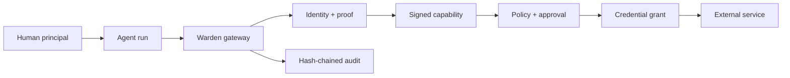

<p align="center">
  <a href="https://www.vouchins.com/warden">
    
  </a>
</p>

<h1 align="center">Warden</h1>

<p align="center">
  <strong>The authorization gateway for AI agents.</strong><br>
  Give agents useful access without giving them unlimited authority—or your credentials.
</p>

<p align="center">
  <a href="https://warden.vouchins.com/">Website</a> ·
  <a href="https://warden.vouchins.com/documentation">Docs</a> ·
  <a href="https://www.npmjs.com/package/@vouchins/warden">npm</a> ·
  <a href="https://pypi.org/project/vouchins-warden/">PyPI</a> ·
  <a href="https://www.vouchins.com/contact">Early access</a>
</p>

---

## What is Warden?

Warden is an open-source control plane that sits between AI agents and the
services they call. Every action passes through one gateway that verifies the
agent and its current run, checks signed authority, evaluates deterministic
policy, obtains approval when required, and only then resolves a credential and
calls the external service.

**Why we built it:** agents are moving from generating text to changing real
systems. Giving each agent an API key and relying on its prompt to respect
limits is not an authorization model.

**How it works:** an agent receives a short-lived capability describing exactly
what it may do. Warden independently verifies that capability and a separate
credential grant, applies layered policy, and injects the downstream credential
inside the gateway. The agent never receives the real secret.

## Authorization path


```mermaid
flowchart LR
  H["Human principal"] --> A["Agent run"]
  A --> G["Warden gateway"]
  G --> I["Identity + proof"]
  I --> C["Signed capability"]
  C --> P["Policy + approval"]
  P --> V["Credential grant"]
  V --> X["External service"]
  G --> L["Hash-chained audit"]
```

A failure at any stage stops the request before secret resolution and before
the external call.

## Quick start

```bash
git clone https://github.com/ishaiktaher/warden.git
cd warden
python3.11 -m venv .venv
source .venv/bin/activate
pip install -r requirements.txt
cp .env.example .env
uvicorn control_plane.api:app --reload
```

Open [http://127.0.0.1:8000](http://127.0.0.1:8000) for the management
console, or [http://127.0.0.1:8000/documentation](http://127.0.0.1:8000/documentation)
for the integration guide.

> Local mode uses a development administrator key. Production mode fails
> closed unless PostgreSQL, Redis, OIDC, external signing, secret custody, and
> immutable audit storage are configured.

## Use from any agent runtime

### JavaScript and TypeScript

```bash
npm install @vouchins/warden
```

```ts
import { WardenClient } from "@vouchins/warden";

const warden = new WardenClient({
  baseUrl: "https://warden.example.com",
  accessToken: process.env.WARDEN_RUNTIME_TOKEN,
});

const result = await warden.execute({
  capability_token: capability,
  runtime_proof: runtimeProof,
  task_id: taskId,
  connector_id: "github-issues",
  action: "issues.create",
  resource: "repo://acme/app",
  environment: "prod",
  grant_id: githubGrantId,
  parameters: { title: "Investigate production alert" },
});
```

### Python and CLI

```bash
pip install vouchins-warden
```

```python
from vouchins_warden import WardenClient

warden = WardenClient(
    "https://warden.example.com",
    access_token=workload_oidc_token,
)

result = warden.execute(
    capability_token=capability,
    runtime_proof=runtime_proof,
    task_id=task_id,
    connector_id="github-issues",
    action="issues.create",
    resource="repo://acme/app",
    environment="prod",
    grant_id=github_grant_id,
    parameters={"title": "Investigate production alert"},
)
```

The model and agent framework are metadata to Warden. Any runtime that can make
an HTTPS request can use the same gateway.

## Features

- **Agent and run identity** — bind every request to a human, agent, run, task,
  environment, and approved manifest version.
- **Signed capabilities** — issue short-lived RS256 authority scoped to exact
  actions and resources, with revocation and proof of possession.
- **Safe delegation** — allow child agents to receive narrower authority that
  cannot exceed the parent capability.
- **Policy outside the model** — enforce tool, action, resource, data, risk,
  geography, rate, and approval rules deterministically.
- **Credential isolation** — keep OAuth tokens and managed secrets in Warden
  custody and inject them only after an allow decision.
- **Immediate containment** — revoke agents, runs, grants, capabilities,
  connectors, policies, or the whole gateway.
- **One gateway** — REST, MCP, A2A, JavaScript, Python, and CLI requests converge
  on the same authorization path.
- **Verifiable audit** — record redacted decisions and outcomes in a
  hash-chained ledger with optional immutable external anchoring.
- **Portable infrastructure** — select AWS, Azure, Google Cloud, HashiCorp
  Vault, PKCS#11, portable HTTPS providers, or your own provider plugin.

## Architecture

| Component | Responsibility |
| --- | --- |
| Control plane | Agent registry, runs, tasks, policies, approvals, revocations |
| Capability service | RS256 issuance, verification, delegation, rotation |
| Action gateway | Mandatory authorization and connector dispatch |
| Credential broker | OAuth and managed-secret custody, grants, injection |
| Connector layer | Local emulator, REST, MCP upstream, A2A upstream |
| Audit ledger | Redacted hash chain, verification, export, immutable anchors |
| Management UI | Onboarding, agents, policies, connections, approvals, logs |
| SDKs | Dependency-free JavaScript/TypeScript and Python clients plus CLI |

Production state uses PostgreSQL with tenant row-level security and Redis for
distributed limits, locks, idempotency, and approval claims. OIDC authenticates
humans and workloads. Private signing keys and downstream credentials can
remain entirely in infrastructure selected by the operator.

## Run the included examples

```bash
# Multi-agent support-ticket workflow
python -m scripts.run_support_ticket

# Warden-protected Vouchins blog publishing agent
python -m scripts.run_blog_agent
```

Both examples use the real authorization path. Their default connectors are
side-effect-free local emulators; production connectors remain separately
credentialed and approval-gated.

## Project structure

```text
control_plane/     Core API, authorization, policy, custody, connectors, audit
sdk-js/            @vouchins/warden JavaScript and TypeScript SDK
sdk-python/        vouchins-warden Python SDK and CLI
ui/                Public site, documentation, onboarding and management UI
examples/          Reference agents and integration manifests
scripts/           Migrations, demos, preflight and proof generation
deploy/            Kubernetes and optional AWS Terraform deployment
requirements/      Development and optional provider dependency packs
tests/             Security, API, provider, SDK and integration tests
```

## Development

```bash
pip install --require-hashes -r requirements/dev.txt
python -m unittest discover -s tests -v
ruff check api control_plane examples scripts tests sdk-python/src sdk-python/tests
mypy --ignore-missing-imports api control_plane examples scripts sdk-python/src
```

JavaScript SDK:

```bash
cd sdk-js
npm ci
npm test
npm audit
```

## Production

The Vercel deployment is intentionally a read-only website and documentation
surface. Deploy the authenticated gateway as an OCI container with durable
PostgreSQL, Redis, OIDC, TLS, restricted egress, external custody providers,
telemetry, backups, and reviewed migrations.

- [Production operations](docs/PRODUCTION.md)
- [Provider portability](docs/PROVIDERS.md)
- [Credentials and grants](docs/CREDENTIALS.md)
- [Deployment at warden.vouchins.com](docs/WARDEN_VOUCHINS_DEPLOYMENT.md)
- [Beginner-friendly implementation guide](docs/BEGINNERS_GUIDE.md)

## License

[MIT](LICENSE) — Warden is a product of [Vouchins](https://www.vouchins.com/).
