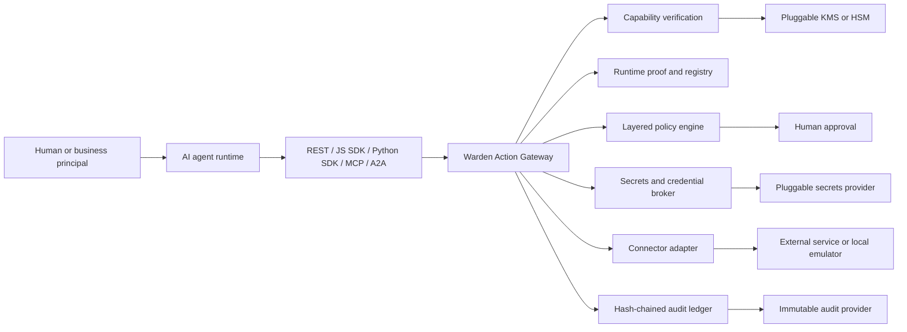
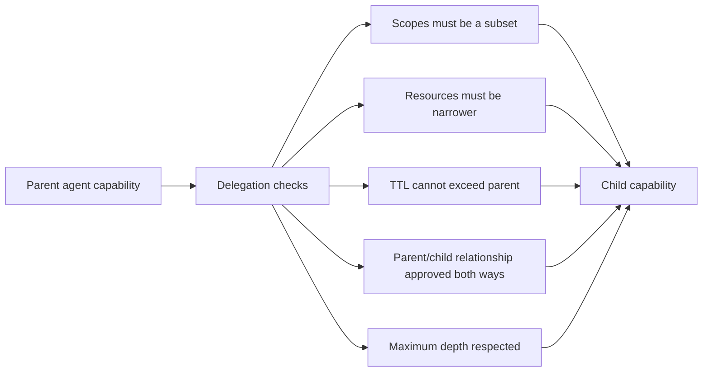
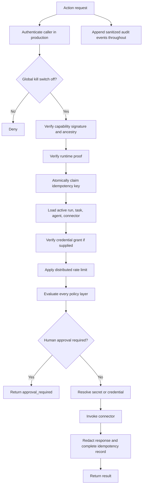

# Warden, Explained from First Principles

This guide explains the complete Warden application for someone who is new to
AI agents, backend systems, and security engineering. It starts with the idea,
introduces each building block, and then follows a real request through every
security gate until an external action is either executed or blocked.

The most important sentence in this document is:

> Warden does not trust an AI agent merely because the agent says it is allowed
> to do something.

Warden checks identity, delegated authority, policy, human approval, credential
access, and the exact requested resource in ordinary backend code outside the
AI model.

## 1. The idea

AI agents can read information, make plans, and call tools. A useful production
agent might:

- update a customer record;
- create a Jira ticket;
- send an email;
- read a repository;
- modify cloud infrastructure;
- trigger a payment;
- call another agent.

Giving an agent tools creates a security problem. The model can make a mistake,
be manipulated by prompt injection, misunderstand the user, or attempt an
action that exceeds its job. A prompt such as "never spend more than ₹5,000" is
only an instruction. If the same model also owns the payment credential and the
payment tool, it can still ignore or misread that instruction.

Warden moves enforcement outside the model. An agent asks Warden to perform an
action. Warden independently decides whether the request is valid. Only Warden
can reach the registered connector and resolve its credential.

Think of Warden as a security desk in an office building:

- the **agent registry** is the employee directory;
- a **run** is today's signed visitor record;
- a **capability** is a temporary access badge;
- a **policy** is the building rulebook;
- an **approval** is a manager authorizing a sensitive room;
- a **credential grant** is permission to use a particular company account;
- a **connector** is a guarded door;
- the **audit ledger** is the tamper-evident security log.

The agent can request entry, but it cannot unlock the door itself.

## 2. What Warden is—and is not

Warden is a generic control plane for privileged actions performed by AI
agents. It is independent of the model vendor and the agent framework. An
OpenAI agent, an Anthropic agent, a local model, an MCP client, an A2A runtime,
or ordinary application code can all use the same gateway.

Warden is not:

- an LLM;
- an agent planner;
- a chatbot;
- a workflow engine;
- a replacement for the downstream SaaS API;
- a replacement for cloud IAM, network firewalls, or an identity provider.

It sits between agent runtimes and privileged tools. Agent owners describe
permissions using data—manifests, policies, grants, and connector definitions—
instead of editing Warden source code for every new agent.

The support-ticket scenario in this repository is only an example. The product
itself is not tied to support tickets, travel, payments, Hermes, or any specific
agent framework.

## 3. The architecture at a glance



The Action Gateway is the mandatory path. A connector is never handed directly
to an agent. This is the architectural rule that makes the other controls
meaningful.

## 4. The five identities in one action

Warden records identity more precisely than simply storing an `agent_id`.

```text
principal_id → agent_id → run_id → task_id → tool_call_id
```

### 4.1 Principal

The principal is the human, customer, workload, or business identity on whose
behalf the work is happening. Examples are `user-123`, a service account, or an
enterprise tenant user.

### 4.2 Agent

The agent is the approved software role, such as `support-triage` or
`code-reviewer`. Its manifest defines its maximum possible authority. A token
cannot grant an action that the manifest does not allow.

### 4.3 Run

A run is one active execution session of one agent for one principal and one
purpose. Creating a run returns a one-time `runtime_proof`. Warden stores only a
hash of that proof. A stolen capability token is insufficient without the proof
bound to its run.

### 4.4 Task

A task is a bounded unit of work within a run. Tasks may have parent tasks,
which lets Warden represent a manager agent dividing work among specialists.

### 4.5 Tool call

A tool call is one attempted connector invocation. It records the exact action,
resource, connector, status, and timestamps.

This identity chain lets an auditor answer: "Which agent, in which run, for
which user, as part of which task, attempted this exact external operation?"

## 5. Agent registration and ownership

An agent owner first submits an `AgentManifest`. Important fields include:

| Field | Meaning |
|---|---|
| `agent_id` | Stable machine-readable identity |
| `owner` | Team or tenant responsible for the agent |
| `purpose` | Human-readable job description |
| `model_provider` | Informational metadata; it does not control compatibility |
| `agent_version` | Version under review |
| `environment` | `dev`, `test`, or `prod` |
| `risk_tier` | `low`, `medium`, `high`, or `critical` |
| `allowed_tools` | Tool families the agent may use |
| `allowed_actions` | Exact actions it may request |
| `allowed_data_classifications` | Data sensitivity levels it may handle |
| `max_delegation_depth` | Maximum child-agent depth |
| `approved_parents` | Agents allowed to delegate work to it |
| `approved_children` | Agents to which it may delegate |

Registration creates a `pending` version. An administrator must approve it
before a run can be created. Updating the manifest returns the agent to
`pending`, so changing an agent's code version or permissions cannot silently
reuse an earlier approval.

Agent lifecycle states are:

```text
pending → active → suspended or retired
```

In production, tenant-owned agent IDs must begin with `<tenant>--`, and the
manifest owner must match the authenticated tenant.

## 6. Connectors: the only path to tools

A connector tells Warden how one approved action reaches a tool. Its manifest
contains:

- a stable `connector_id`;
- the tool family;
- one exact action;
- an adapter type;
- allowed resource patterns;
- required capability scopes;
- risk tier and rate limit;
- optional endpoint and HTTP method;
- optional secret alias or credential grant requirement;
- credential injection mode.

Supported adapter types are:

| Adapter | Purpose |
|---|---|
| `local` | Built-in reference adapters used by the support example |
| `local_emulator` | Owner-configurable generic records for testing |
| `rest` | HTTPS JSON API |
| `mcp_upstream` | Adapts the request to an upstream MCP `tools/call` shape |
| `a2a_upstream` | Adapts the request to an upstream A2A message shape |
| `github_readonly` | Reference read-only repository adapter |
| `database` | Reserved for an operator-provisioned database sandbox |
| `shell_sandbox` | Reserved for an operator-provisioned shell sandbox |
| `browser_sandbox` | Reserved for an operator-provisioned browser sandbox |

The last three fail closed until an operator supplies a real sandbox. Warden
does not quietly execute a local shell or browser.

### External connector protection

For REST, upstream MCP, and upstream A2A connectors, Warden:

1. requires HTTPS on port 443;
2. checks the hostname against the configured egress allowlist;
3. rejects credentials embedded in the URL and rejects fragments;
4. resolves DNS and rejects every loopback, private, link-local, or otherwise
   non-public address;
5. pins the request to the validated IP to prevent DNS rebinding;
6. keeps the original hostname for TLS SNI and certificate verification;
7. ignores environment proxy settings that could reroute the request;
8. rejects redirects;
9. requires a JSON response;
10. streams no more than 1 MiB of response data.

Network-level egress policy is still recommended as a second layer.

## 7. Capabilities: temporary, signed authority

A capability is a short-lived RS256-signed token. It answers:

> What may this exact agent run do, to which resources, for which principal,
> and until when?

Important claims include:

| Claim | Meaning |
|---|---|
| `iss` | Warden issuer |
| `aud` | Intended Warden gateway audience |
| `agent_id` / `sub` | Agent receiving authority |
| `run_id` | Runtime session receiving authority |
| `principal_id` | User or workload on whose behalf it acts |
| `scopes` | Allowed actions |
| `resources` | Allowed resource patterns |
| `iat` / `exp` | Issue and expiry timestamps |
| `jti` | Unique token identifier |
| `delegation_depth` | Current depth in the agent tree |
| `parent_jti` | Parent capability, if delegated |

Tokens live for at most one hour. Issuance refuses scopes outside the agent
manifest. Verification checks the signature, key status, issuer, audience,
expiry, token registry status, run status, agent status, complete parent chain,
expected action, and expected resource.

The signing key has a `kid` so keys can rotate. Retired keys can continue
verifying earlier tokens until explicitly revoked. Revoking a key immediately
invalidates every token signed by it.

Development can store a local RSA private key. Production rejects local signing
and requires an external provider such as AWS KMS, Azure Key Vault, Google Cloud
KMS, Vault Transit, PKCS#11, a portable HTTPS provider, or an operator plugin.

## 8. Delegation between agents

Delegation is how a manager agent gives a smaller job to a specialist.



The parent must present both its capability and its `runtime_proof`. The child
run must belong to the same principal and name the parent run. The child token
cannot add a scope, broaden a resource, outlive its parent, or bypass either
agent manifest.

Revoking or expiring a parent capability invalidates all descendants because
verification walks the complete ancestry.

## 9. Policies: rules that can only narrow authority

Capabilities say what was delegated. Policies independently say what the
organization currently permits. Both must allow the action.

Policy layers are evaluated together:

```text
platform → tenant → agent → connector → credential grant
```

The merge is monotonic: a lower layer may make access narrower but cannot
remove a denial imposed by a higher layer.

Current policy controls include:

- denied tools;
- denied actions;
- human approval for production writes;
- human approval for selected risk tiers;
- a required scope for sensitive data;
- maximum anomaly score;
- allowed geographies;
- mandatory credential grants for external connectors.

The default policy denies the `shell` tool, requires approval for production
writes and high/critical connectors, requires `data:sensitive` for sensitive
data, and rejects anomaly scores above `0.8`.

An action must also satisfy the agent manifest, connector requirements,
capability scopes, capability resources, connector resource patterns, data
classification, environment, active lifecycle state, and risk signals.

If there is no active applicable policy, Warden denies the request. This is
called **fail closed**.

## 10. Human approval

When policy requires a human decision, the first action request returns:

```json
{
  "status": "approval_required",
  "approval_id": "...",
  "reason": "Human approval is required"
}
```

An administrator approves or denies that exact tuple:

```text
run + task + agent + action + resource
```

The approval expires after ten minutes. When the agent retries, Warden
atomically changes it from `approved` to `executing`. Only one concurrent
request can claim it. After success it becomes `consumed`. If the downstream
result is uncertain, it becomes `uncertain` for operator reconciliation.

This prevents a broad statement such as "approve this agent" from authorizing a
different action or resource later.

## 11. Secrets, connections, and credential grants

There are three related ideas:

### Secret alias

A secret alias is an opaque name such as `github-client-secret`. The agent sees
the alias at most; it never receives the resolved value. Resolution happens
inside the gateway only after capability and policy approval.

Local development encrypts secrets using Fernet. Production forbids local
custody and requires an external secrets provider.

### Credential connection

A connection represents a real account relationship, for example a user's
GitHub account or a managed API account. It owns the encrypted credential and
provider metadata.

### Credential grant

A grant says who may use that connection and under what restrictions:

- permitted actions/scopes;
- HTTP methods;
- endpoint path patterns;
- expiry;
- delegated agent;
- active or revoked status.

The capability and the grant are verified independently. Possessing a token
does not grant account access, and possessing a grant does not grant action
authority.

Supported credential injection modes are bearer token, custom header, multiple
headers, HTTP Basic, query parameter, and AWS SigV4. Injection happens at the
connector boundary. Warden never returns the injected credential to the agent.

### GitHub OAuth lifecycle

1. An administrator stores the GitHub OAuth client secret under an alias.
2. The administrator registers the GitHub provider and its allowed scopes.
3. A user starts a connection request with desired provider and agent scopes.
4. Warden creates short-lived, single-use OAuth state.
5. GitHub redirects to the public callback.
6. Warden exchanges the code, reads the GitHub identity, stores the token, and
   creates the connection and bounded grant.
7. The user delegates the grant to an approved agent.
8. Warden refreshes expiring credentials under a production distributed lock.
9. Disconnecting first asks GitHub to revoke the provider token, then revokes
   local grants and secret custody.

## 12. The exact action-execution pipeline

This is the core of Warden. A request to `/actions/execute`, MCP, or A2A follows
the same pipeline.



In detailed order:

1. Pydantic validates the strict request schema and rejects unknown fields.
2. Production middleware verifies the OIDC access token.
3. The runtime role and agent identity are checked.
4. The global kill switch is checked.
5. The RS256 capability signature and claims are verified.
6. The action and resource are checked against the token.
7. The run's secret `runtime_proof` is hashed and compared in constant time.
8. Warden hashes the complete request and atomically claims
   `capability jti + request_nonce`.
9. Reusing a nonce for the same request returns the recorded response; reusing
   it for different parameters is rejected.
10. The active run, agent, task, and connector are loaded.
11. If a grant is supplied, its owner, delegated agent, scopes, method, path,
    expiry, connection status, and revocation state are checked.
12. The connector/token rate limit is enforced.
13. Warden creates a tool-call identity and writes `action.requested`.
14. The layered policy engine evaluates identity, authority, resources, data,
    environment, risk, grant requirements, and approval.
15. A denial stops here. No secret is resolved and no connector is called.
16. If needed, the exact approval is atomically claimed.
17. Only now does the broker resolve the downstream credential.
18. The connector injects that credential and performs the external operation.
19. Warden records success, consumes the approval, redacts the result, and
    stores the idempotent response.
20. The caller receives a sanitized response and `tool_call_id`.

Every exception is converted into a safe error. Credential values and provider
diagnostics are not included in the agent-facing reason or audit payload.

## 13. Rate limiting, idempotency, and the kill switch

These controls solve different problems:

- **Rate limiting** restricts how many times a token can use a connector per
  minute. Development uses the local database; production requires Redis and
  an atomic Lua counter.
- **Idempotency** prevents accidental duplicate side effects when a client
  retries after a timeout. A nonce is bound to the hash of the complete request.
- **The kill switch** immediately blocks every action request during an
  incident without deleting agents, tokens, or policies.

Revocation is available for individual tokens, complete runs and descendant
runs, agents, connectors, policies, grants, connections, secrets, and signing
keys. These are narrower incident-response tools than the global kill switch.

## 14. Audit and observability

Warden writes security events such as:

- agent registered, approved, suspended, or updated;
- run and task created;
- token issued, delegated, or revoked;
- policy allowed or denied;
- approval requested, resolved, claimed, or consumed;
- credential exercised or revoked;
- connector invoked;
- action executed, denied, or failed;
- key rotated;
- audit head anchored.

Sensitive dictionary keys and bearer values are redacted before persistence.
Each event includes the previous event hash. Warden hashes the previous hash
plus the canonical current event, creating a chain:

```text
GENESIS → event 1 → event 2 → event 3 → ... → current head
```

Changing or deleting a historical event breaks verification. The ledger can be
filtered, verified, exported as NDJSON, and anchored to an immutable provider.
An external anchor proves that an operator did not simply rewrite both the
event and every later local hash.

`/live`, `/ready`, and `/health` are intentionally constant-time probes. Full
chain verification is an authenticated operation because rescanning a growing
ledger on every Kubernetes probe would eventually overload the database.

Request middleware adds a request ID, structured duration/status logs, CSP,
`X-Frame-Options`, `X-Content-Type-Options`, referrer policy, and no-store cache
headers. OpenTelemetry export is enabled when an OTLP endpoint is configured.

## 15. Development authentication versus production authentication

### Development

- Administrator calls use `X-Admin-Key`.
- If no key is configured, the local-only fallback is
  `local-development-admin-key`.
- Owners receive a random API key once; Warden stores only its SHA-256 hash.
- Owner calls use `X-Owner-Id` and `X-Owner-Key`.
- Runtime authority is still protected by the capability and `runtime_proof`.

### Production

- Local header authentication is disabled.
- Every protected request requires an OIDC bearer token.
- Claims identify the subject, tenant, roles, audience, issuer, and optional
  on-behalf-of principal.
- Admin operations require `warden:admin`.
- Owner operations require `warden:agent-owner` or `warden:admin`.
- Runtime operations require `warden:runtime` or `warden:admin`.
- Audit operations require `warden:auditor` or `warden:admin`.
- Runtime callers are bound to the agent identity in the OIDC subject.
- PostgreSQL tenant context and row-level security isolate tenant data.

Public production routes are limited to probes, documentation, OpenAPI, public
signing keys, and the OAuth callback.

## 16. Data storage

Local development uses SQLite in WAL mode. It stores registries, runs, tasks,
tool calls, capability metadata, policies, approvals, connector definitions,
credential grants, encrypted secret references, idempotency records,
revocations, audit events, and local emulator data.

Production requires PostgreSQL with connection pooling and row-level security.
It also requires Redis for distributed rate limiting and refresh coordination.
Automatic migration is off by default; production migrations should be a
reviewed deployment step.

The database stores capability metadata and public signing keys. With an
external signing provider, the RSA private key never enters the database.
Similarly, an external secret provider leaves only opaque references in Warden.

## 17. Vendor-neutral provider design

Warden defines three small provider interfaces:

1. **Signing provider**—return the active public key and sign bytes.
2. **Secrets provider**—put, get, and revoke an opaque secret reference.
3. **Audit anchor provider**—write a hash-chain checkpoint with retention.

Operators may choose providers independently. Signing can use one vendor,
secrets another, and audit storage a third. Supported first-party adapters
include AWS, Azure, Google Cloud, HashiCorp Vault, and PKCS#11 HSMs. A portable
HTTPS contract and `module.path:factory` plugin contract allow other vendors
without changing the gateway.

Cloud SDK packages live in optional requirement packs. They are not installed
in the core image, which reduces vendor lock-in and attack surface.

## 18. Ways an agent can call Warden

All ingress methods reach the same `execute_action` service. Protocol choice
does not change security.

### REST

```http
POST /actions/execute
```

### MCP

```json
{
  "method": "tools/call",
  "params": { "...same ActionRequest fields...": "..." }
}
```

### A2A

```json
{
  "message_type": "message:send",
  "action_request": { "...same ActionRequest fields...": "..." }
}
```

### JavaScript/TypeScript

The public package is `@vouchins/warden`:

```bash
npm install @vouchins/warden
```

```ts
import { WardenClient } from "@vouchins/warden";

const warden = new WardenClient({
  baseUrl: "https://warden.example.com",
  accessToken: process.env.WARDEN_RUNTIME_TOKEN,
});

const result = await warden.execute({
  capability_token: capability,
  runtime_proof: runtimeProof,
  task_id: taskId,
  connector_id: "github-issues",
  action: "issues.create",
  resource: "repo://acme/app",
  environment: "prod",
  request_nonce: crypto.randomUUID(),
  grant_id: githubGrantId,
  parameters: { title: "Agent-created issue" },
});
```

The SDK rejects non-local plaintext HTTP URLs, generates unique nonces by
default, supports ESM and CommonJS, and has no runtime dependencies.

### Python

`control_plane.sdk.WardenClient` provides the equivalent Python integration.
An agent framework only needs to make HTTP requests; its model provider remains
metadata.

## 19. API map

FastAPI generates the authoritative request schemas at `/docs` and
`/openapi.json`. The endpoints are grouped below by responsibility.

### Service and public metadata

| Method | Path | Purpose |
|---|---|---|
| GET | `/live` | Shallow process liveness |
| GET | `/ready` | Constant-time database and Redis readiness |
| GET | `/health` | Minimal service health |
| GET | `/.well-known/warden-keys` | Capability public keys |

### Owners and agent registry

| Method | Path | Purpose |
|---|---|---|
| POST | `/admin/owners` | Create an owner and return its one-time API key |
| GET | `/owners/agents` | List an owner's agents |
| POST | `/owners/agents` | Submit a pending agent manifest |
| PUT | `/owners/agents/{agent_id}` | Submit a new pending agent version |
| POST | `/owners/connectors` | Submit a pending connector |
| GET | `/admin/agents` | List all agents |
| POST | `/admin/agents` | Administrative registration path |
| POST | `/admin/agents/{agent_id}/approve` | Approve the current version |
| POST | `/admin/agents/{agent_id}/status` | Suspend, activate, or retire an agent |

### Runs, tasks, and capabilities

| Method | Path | Purpose |
|---|---|---|
| POST | `/runs` | Create a run and return its runtime proof |
| POST | `/tasks` | Create a task within a run |
| POST | `/admin/capabilities/issue` | Issue root authority |
| POST | `/capabilities/delegate` | Create narrower child authority |
| POST | `/admin/capabilities/{jti}/revoke` | Revoke one token |
| POST | `/admin/runs/{run_id}/revoke` | Revoke a run and descendants |
| POST | `/admin/keys/rotate` | Activate a new signing key |
| POST | `/admin/keys/{kid}/revoke` | Revoke a signing key |

### Connector and policy management

| Method | Path | Purpose |
|---|---|---|
| GET | `/admin/connectors` | List connectors |
| POST | `/admin/connectors` | Register or update a connector |
| POST | `/admin/connectors/{connector_id}/status` | Change connector lifecycle |
| POST | `/admin/policies` | Activate a new policy version/layer |
| POST | `/admin/policies/{policy_id}/revoke` | Revoke a policy |
| POST | `/admin/kill-switch` | Enable or disable global execution |

### Secrets, connections, and grants

| Method | Path | Purpose |
|---|---|---|
| POST | `/admin/secrets` | Store or rotate a secret alias |
| POST | `/admin/secrets/{alias}/revoke` | Revoke an alias |
| POST | `/admin/oauth/providers/github` | Configure GitHub OAuth |
| POST | `/connect/github/start` | Begin user authorization |
| GET | `/oauth/github/callback` | Complete the OAuth callback |
| POST | `/admin/connections/managed` | Create a non-OAuth connection and grant |
| GET | `/me/connections` | List the caller's connections |
| POST | `/me/connections/{connection_id}/revoke` | Disconnect an account |
| GET | `/me/grants` | List the caller's grants |
| POST | `/me/grants/{grant_id}/delegate` | Delegate a grant to an agent |
| POST | `/me/grants/{grant_id}/revoke` | Revoke a grant |

### Action ingress

| Method | Path | Purpose |
|---|---|---|
| POST | `/actions/execute` | REST execution |
| POST | `/mcp/tools/call` | MCP execution |
| POST | `/a2a/message:send` | A2A execution |

### Approvals and audit

| Method | Path | Purpose |
|---|---|---|
| GET | `/admin/approvals` | List approvals, optionally by status |
| POST | `/admin/approvals/{approval_id}/resolve` | Approve or deny exact authority |
| GET | `/audit/events` | Filter the sanitized timeline |
| GET | `/audit/verify` | Verify the complete hash chain |
| GET | `/audit/export.ndjson` | Export audit evidence |
| POST | `/admin/audit/anchor` | Anchor the current head externally |

### Reference demonstration

| Method | Path | Purpose |
|---|---|---|
| POST | `/admin/demo/bootstrap` | Create local reference data |
| POST | `/admin/demo/support-ticket` | Run the complete CASE-1042 scenario |

Typical HTTP outcomes are `200` for a handled request, `400` for a rejected
control-plane operation, `401` for failed authentication, `403` for a principal
mismatch, `422` for a malformed strict request, and `503` when readiness fails.
An action-level denial normally returns a safe JSON status rather than an HTTP
error so agent runtimes can handle policy outcomes deterministically.

## 20. The CASE-1042 example, step by step

Run it locally with:

```bash
.venv/bin/python -m scripts.run_support_ticket
```

The scenario demonstrates the general architecture:

1. Warden registers and approves a `support-triage` manager agent.
2. Warden registers and approves a read-only `code-reviewer` child agent.
3. It registers CRM, email, Jira, and GitHub reference connectors.
4. It activates a platform policy.
5. It creates support case `CASE-1042` in the local emulator.
6. It creates a production manager run and task.
7. It issues authority for the exact CRM, email, Jira, and repository resources.
8. A CRM update marked `sensitive` uses an extra `data:sensitive` scope.
9. The high-risk production write requests human approval.
10. An administrator approves the exact CRM action and resource.
11. The retry atomically consumes approval and updates the case.
12. The agent creates an email **draft**; it does not send the email.
13. Jira creation also requires and consumes human approval.
14. The manager creates a child run for the code reviewer.
15. It delegates only `github.read` for one repository.
16. The child performs a read-only review.
17. Warden verifies the complete audit chain and returns the authority lineage.

This proves manager/specialist handoff, narrowing delegation, production
approval, sensitive-data scope, exact resource checks, multiple tools,
idempotency, and audit integrity. Replacing the local connector definitions
with real authorized connectors uses the same gateway.

## 21. Management UI and documentation

The root page is a management console for:

- reviewing registered agents and connectors;
- approving agent versions;
- activating policies;
- resolving pending approvals;
- operating the kill switch;
- viewing and verifying the audit trail.

The UI is not the enforcement layer. It calls the same backend APIs available to
automation. Security remains in the gateway if the UI is replaced.

Documentation is available at `/documentation`; `/docs` is FastAPI's generated
interactive OpenAPI reference, and `/openapi.json` is the machine-readable
schema.

## 22. Starting Warden locally

```bash
cd /path/to/warden
python3.11 -m venv .venv
source .venv/bin/activate
pip install --require-hashes -r requirements-dev.txt
cp .env.example .env
uvicorn control_plane.api:app --reload
```

Then open:

- management console: `http://127.0.0.1:8000/`;
- learning documentation: `http://127.0.0.1:8000/documentation`;
- OpenAPI: `http://127.0.0.1:8000/docs`;
- readiness: `http://127.0.0.1:8000/ready`.

Development starts with SQLite, a locally generated Fernet key, a local RSA
signing key, and the fallback admin key. These defaults are intentionally
rejected in production.

## 23. Production requirements

Setting `CONTROL_PLANE_ENV=prod` changes the trust model. Startup fails unless
all required infrastructure is configured:

- PostgreSQL;
- Redis;
- HTTPS public URL;
- OIDC issuer and audience;
- external signing provider;
- external secrets provider;
- external immutable audit provider;
- strong administrator/break-glass configuration;
- explicit egress allowlist.

Production deployment should additionally provide TLS termination, network
policies, backups, migration jobs, OTLP/SIEM collection, alarms, key rotation,
retention policies, provider IAM, and tested incident procedures.

The repository includes:

- a non-root, read-only-root-filesystem-ready container;
- Kubernetes deployment, probes, disruption budget, and default-deny policy;
- an optional AWS Terraform reference;
- portable provider contracts for non-AWS deployments;
- container and npm provenance workflows;
- Gitleaks, Bandit, Ruff, mypy, dependency audits, compatibility matrices, and
  provider-pack CI.

Infrastructure files are a baseline, not proof that an operator's cloud
environment is correctly configured. Production readiness still requires
staging, load, failure, backup, restore, and incident tests.

## 24. Repository map

| Path | Responsibility |
|---|---|
| `control_plane/api.py` | FastAPI routes, protocol facades, authentication dependencies |
| `control_plane/service.py` | Main orchestration and mandatory action pipeline |
| `control_plane/auth.py` | Production OIDC verification and principals |
| `control_plane/crypto.py` | RS256 capabilities, rotation, revocation, delegation ancestry |
| `control_plane/policy.py` | Layered fail-closed policy decisions |
| `control_plane/credentials.py` | OAuth, connections, grants, refresh, revocation |
| `control_plane/secrets.py` | Secret aliases and late resolution |
| `control_plane/connectors.py` | Tool adapters and secure external transport |
| `control_plane/audit.py` | Redaction, hash chain, export, immutable anchoring |
| `control_plane/database.py` | SQLite/PostgreSQL persistence and tenant context |
| `control_plane/providers.py` | Vendor-neutral infrastructure interfaces |
| `control_plane/provider_adapters/` | Azure, GCP, Vault, and PKCS#11 adapters |
| `control_plane/rate_limit.py` | Redis production/local development rate limits |
| `control_plane/resources.py` | Canonical resource matching |
| `control_plane/schemas.py` | Strict API request contracts |
| `control_plane/sdk.py` | Python client |
| `sdk-js/` | Published `@vouchins/warden` SDK |
| `ui/` | Management console and static documentation |
| `migrations/` | Production database evolution |
| `deploy/` | Kubernetes and optional Terraform baseline |
| `scripts/` | Migration and reference-scenario commands |
| `tests/` | Security, behavior, provider, API, and UI regression tests |
| `.github/workflows/` | CI, documentation, npm, and container releases |

## 25. Testing and release safety

The test suite covers:

- tampered, expired, transferred, and revoked capabilities;
- parent/child narrowing and proof of possession;
- agent version reapproval;
- resource canonicalization and traversal attempts;
- exact scope, tool, data, and environment denial;
- atomic approvals and idempotency;
- grant delegation, method/path restrictions, OAuth, refresh, and revocation;
- credential non-disclosure;
- rate limiting and the kill switch;
- audit tamper detection;
- provider interfaces and production refusal of local custody;
- DNS pinning and bounded connector responses;
- REST, MCP, A2A, Python, ESM, CommonJS, and TypeScript surfaces;
- management UI CSP integrity.

Python dependencies are generated from `requirements*.in` into fully pinned,
hashed `requirements*.txt` locks. The JavaScript SDK uses `package-lock.json`
and has zero runtime dependencies. CI actions and the Python container base are
pinned to immutable commits/digests.

The npm package uses semantic versioning. `0.1.0` was initially published
manually; future `sdk-v*` tags use npm trusted publishing and provenance.

## 26. Current boundaries and honest limitations

The following distinctions are important:

- Local CRM, Jira, email, and repository adapters are reference emulators, not
  integrations with a paying customer's production systems.
- The email example creates a draft and deliberately does not send it.
- Database, shell, and browser connector types require operator sandboxes.
- OIDC, PostgreSQL RLS, Redis, KMS/HSM, external secrets, immutable audit,
  OTLP, and egress controls work only when an operator provisions them.
- The code includes provider conformance tests, but live provider tests are
  opt-in because they require real cloud accounts.
- Warden reduces agent risk; it does not make an unsafe downstream API safe.
- A capability is authorization, not proof that the model's plan is correct.
- Human approval remains necessary where organizational policy requires human
  judgment.

These are deployment boundaries, not hidden simulated behavior.

## 27. Glossary

| Term | Plain-language meaning |
|---|---|
| Agent | Software role that plans or requests work |
| Principal | Human or workload for whom the agent acts |
| Manifest | Approved maximum job description and permissions |
| Run | One active execution session |
| Runtime proof | Second secret bound to a run |
| Task | Bounded work item inside a run |
| Capability | Signed, temporary, resource-scoped authority |
| Scope | Named action allowed by a capability or grant |
| Resource | Exact object or pattern the action may target |
| Delegation | Giving narrower authority to a child agent |
| Policy | Current organizational rules applied independently |
| Connector | Guarded adapter to a tool or external service |
| Connection | Stored authorization to a real provider account |
| Grant | Bounded permission to exercise a connection |
| Secret alias | Opaque reference to a credential |
| Idempotency | Safe retry behavior without duplicate side effects |
| Revocation | Immediate invalidation of authority |
| Audit anchor | Externally stored proof of the current ledger head |
| Fail closed | Deny when a required check or dependency is unavailable |

## 28. A useful mental checklist

When adding any new agent or connector, ask these questions in order:

1. Who owns the agent?
2. What is the smallest manifest it needs?
3. Who approves that version?
4. What principal is it acting for?
5. What exact run and task are active?
6. What exact actions and resources should the capability contain?
7. Can a child receive less authority instead of sharing the parent token?
8. Which policy layers should narrow the request?
9. Does the action require a human approval?
10. Does it require a real account connection and grant?
11. Can the secret remain unresolved until the final connector boundary?
12. Is the destination allowlisted and network-isolated?
13. Is the action idempotent or protected by a request nonce?
14. What will the audit trail prove afterward?
15. Which token, run, grant, connector, or global switch stops it during an
    incident?

If these questions have explicit answers, the agent is no longer operating on
vague prompt-based trust. It is operating inside enforceable, inspectable,
revocable authority—which is the central purpose of Warden.

