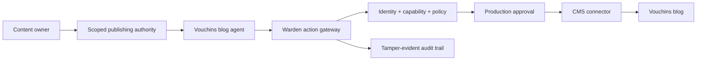

# Vouchins blog automation reference agent

This reference agent demonstrates how a real content workflow uses Warden. The
agent creates a validated blog draft, but its only side effect—publishing—must
cross the Warden action gateway.

## Trust boundary



The content owner or a trusted orchestrator creates the run, task and
capability. The authority is limited to `blog.publish_post` and one logical
resource such as `cms://vouchins/blog/my-post`. The agent cannot mint authority,
change its CMS connector, or read the CMS credential.

## Run the safe local scenario

With the normal local control-plane configuration:

```bash
python -m scripts.run_blog_agent
```

The script uses the real Warden identity, token, policy, connector and audit
code. Its connector is a local emulator, so it creates no public side effect.
The JSON result includes the capability ID, tool-call ID and audit verification.

## Connect a real CMS

`examples.blog_agent.setup.wordpress_connector()` creates a REST connector for
a WordPress-compatible posts endpoint. It sends the validated post object as the
native JSON body. Configure the CMS hostname in
`CONTROL_PLANE_ALLOWED_EGRESS_HOSTS`, then provision the username and application
password through Warden's managed-credential flow with fields `username` and
`password` (the latter contains the CMS application password). Delegate the resulting grant to
`vouchins-blog-publisher`; pass only the `grant_id` to the agent.

Production registrations must use Warden's tenant-prefixed IDs, for example
`vouchins--vouchins-blog-publisher` and
`vouchins--vouchins-blog-wordpress`; both manifest helpers accept explicit IDs.

The helper deliberately accepts no credential argument. Warden resolves and
injects the credential only after capability and policy checks allow the action.
A production publish is a write and therefore returns `approval_required` until
an authorized human approves that exact action and resource.

Vouchins' current public site exposes a Blog navigation item, but this repository
does not assume which CMS operates behind it. Confirm the production CMS and its
posts endpoint before registering the real connector.

## Bring your own model

`DraftGenerator` is a small protocol. The bundled `TemplateDraftGenerator` is
deterministic so CI and demos do not depend on a model vendor. Replace it with a
generator backed by your agent runtime while keeping `BlogAutomationAgent` and
`PublishingAuthority` unchanged. Model output is always revalidated as a
`BlogDraft` before it reaches Warden.
